# 🐦 Twitter Sentiment Analysis using Deep Learning and LSTM

## 📝 Description

Twitter has become one of the largest platforms where people express opinions about products, services, events, and organizations. Analyzing these opinions manually is difficult because of the massive amount of data generated every day.

This project presents an end-to-end **Twitter Sentiment Analysis System** using **Natural Language Processing (NLP)** and **Deep Learning (Bidirectional LSTM)** to classify tweets into **Positive**, **Neutral**, and **Negative** sentiments.

The project also includes an interactive **Streamlit web application (SentiScope AI)** that allows users to analyze tweets in real time, visualize prediction confidence, compare machine learning models, and download prediction reports.

---

# 🚀 Live Demo

**Streamlit Web Application**

> *(https://sentiscopeai.streamlit.app/)*

---

# 📊 Dataset

**Dataset Name**

Twitter US Airline Sentiment Dataset

**Source**

Kaggle

https://www.kaggle.com/datasets/crowdflower/twitter-airline-sentiment

### Dataset Information

- Total Tweets: **14,640+**
- Classes:
  - 😊 Positive
  - 😐 Neutral
  - 😠 Negative

The dataset contains airline-related tweets collected from Twitter and manually labeled according to customer sentiment.

---

# ✨ Features

- Real-time Tweet Sentiment Prediction
- Deep Learning using Bidirectional LSTM
- Text Preprocessing using NLTK
- Confidence Score Visualization
- Prediction Probability Charts
- Machine Learning Model Comparison
- Interactive Streamlit Dashboard
- PDF Report Generation
- CSV Export
- Live Sentiment Stream Simulation
- Dataset Analytics
- Responsive User Interface

---

# 🧠 Technologies Used

### Programming Language

- Python

### Libraries

- TensorFlow / Keras
- Scikit-learn
- Pandas
- NumPy
- Matplotlib
- NLTK
- WordCloud
- Streamlit
- Plotly

---

# ⚙️ Model Architecture

```
Embedding
      ↓
SpatialDropout1D
      ↓
Bidirectional LSTM
      ↓
Dropout
      ↓
Dense (128)
      ↓
Batch Normalization
      ↓
Dropout
      ↓
Dense (64)
      ↓
Softmax Output Layer
```

---

# 📈 Model Performance

| Model | Accuracy |
|--------|----------|
| Logistic Regression | **78%** |
| Naive Bayes | **73%** |
| LSTM | **78%** |

---

# 📷 Project Screenshots

## 🏠 Dashboard

<p align="center">
  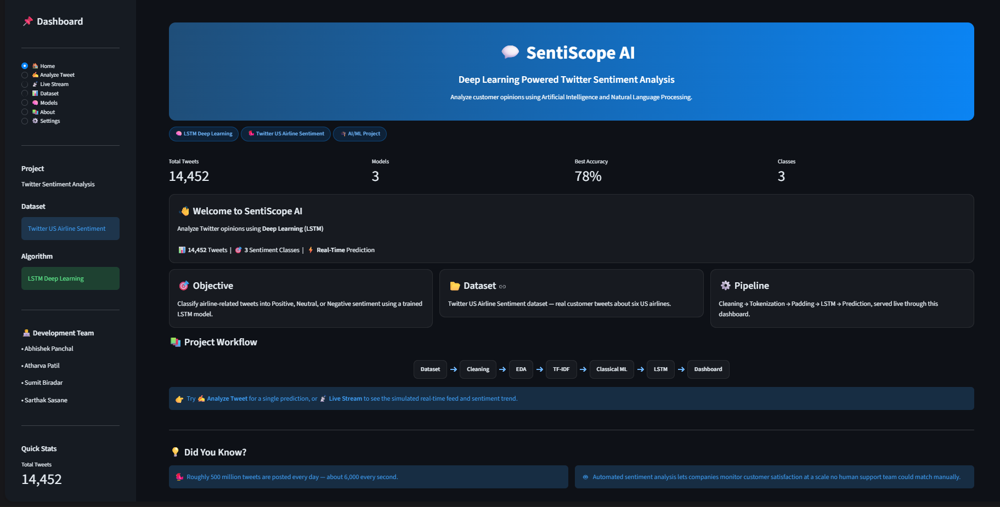
</p>

---

## ✍️ Analyze Tweet

<p align="center">
  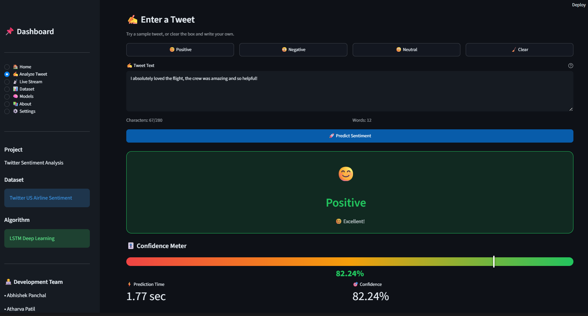
</p>

---

## 📊 Prediction Analytics

<p align="center">
  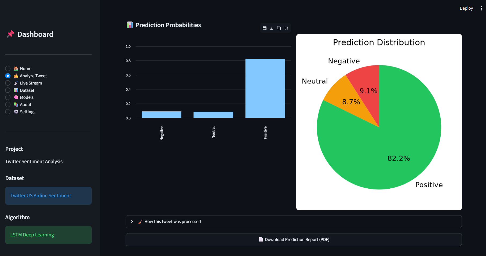
</p>

---

## 📈 Sentiment Distribution

<p align="center">
  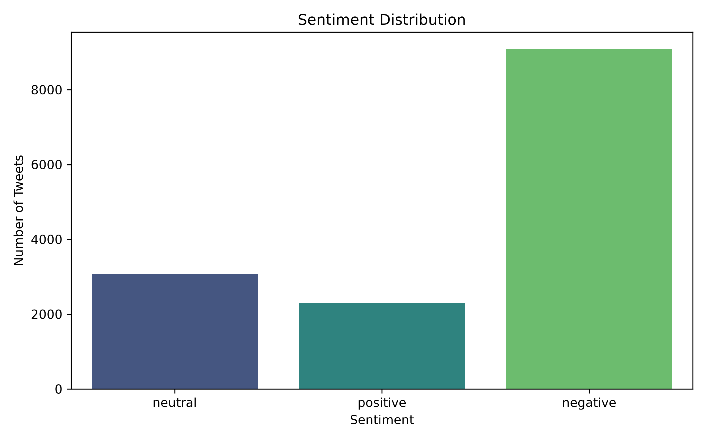
</p>

---

## ☁️ Word Clouds

### Positive

<p align="center">
  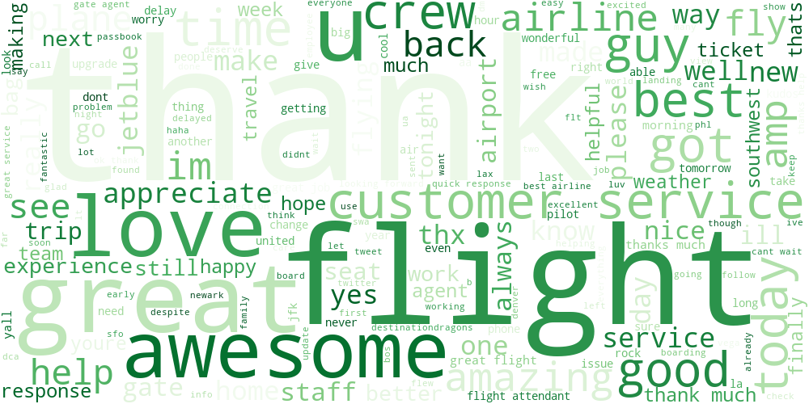
</p>

### Negative

<p align="center">
  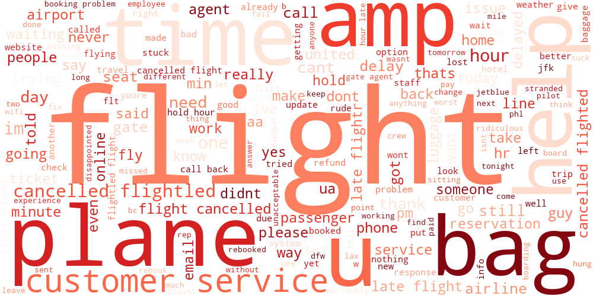
</p>

---

## 📉 Confusion Matrix

### Logistic Regression

<p align="center">
  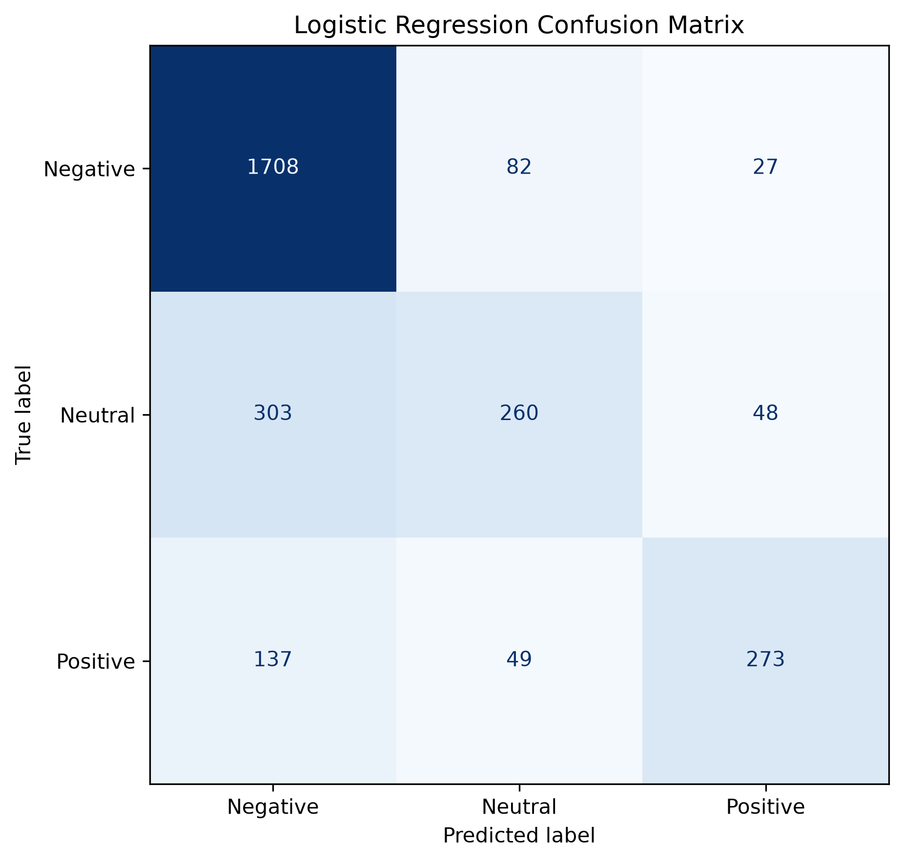
</p>

### Naive Bayes

<p align="center">
  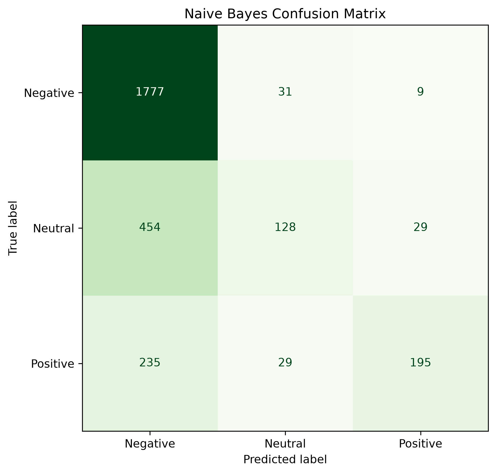
</p>

### LSTM

<p align="center">
  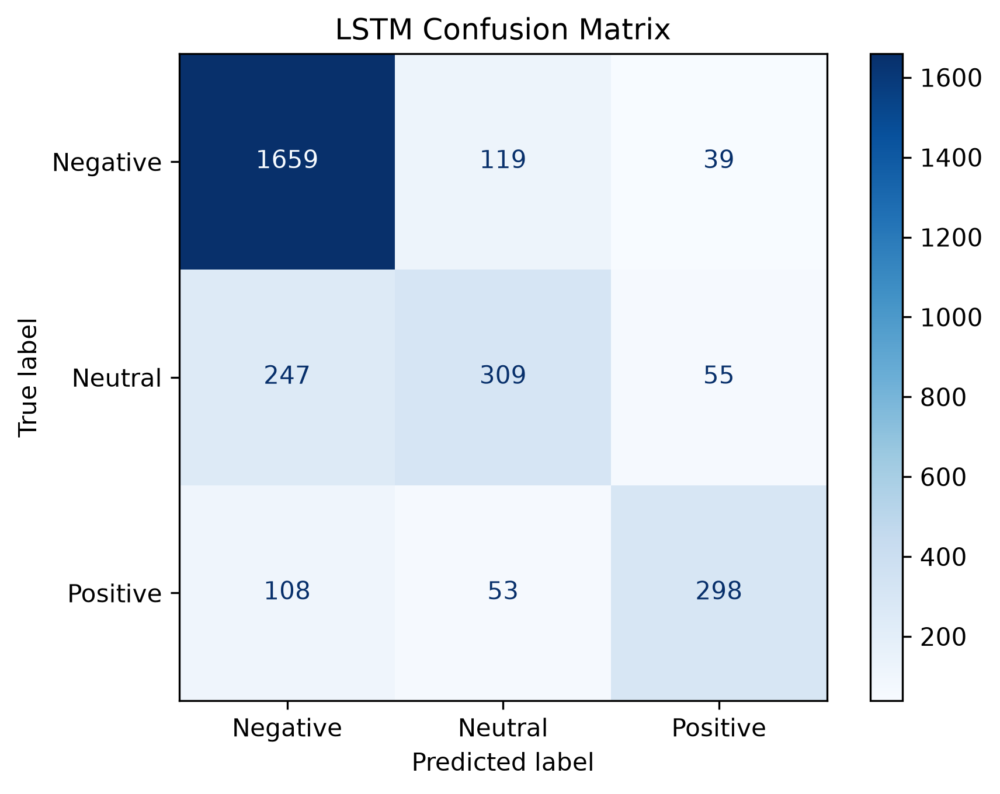
</p>

---

## 📊 Training Curves

### Accuracy

<p align="center">
  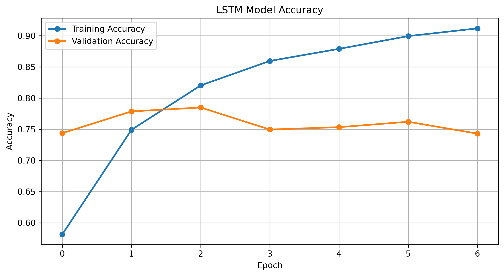
</p>

### Loss

<p align="center">
  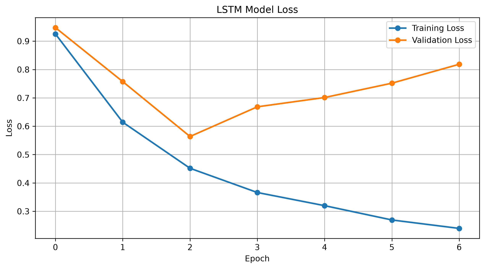
</p>


---

# 🛠 Installation

Clone the repository

```bash
git clone https://github.com/AbhishekPanchal008/Twitter-Sentiment-Analysis.git
```

Go to the project folder

```bash
cd Twitter-Sentiment-Analysis
```

Install dependencies

```bash
pip install -r requirements.txt
```

Run the Streamlit application

```bash
streamlit run app.py
```

---

# 💻 How to Use

1. Launch the Streamlit application.
2. Navigate to **Analyze Tweet**.
3. Enter any tweet.
4. Click **Predict Sentiment**.
5. View:
   - Predicted Sentiment
   - Confidence Score
   - Prediction Probability
6. Download the prediction report as PDF.
7. Explore Dataset Analytics and Model Comparison pages.

---

# 📌 Future Improvements

- BERT / RoBERTa based sentiment analysis
- Multilingual tweet classification
- Live Twitter/X API integration
- Emotion Detection
- Explainable AI (SHAP/LIME)
- Docker Deployment
- Cloud Deployment (AWS/Azure)

---

# 📄 License

This project is licensed under the **MIT License**.

---

# 👨‍💻 Development Team

**Abhishek Panchal**
**Atharva Patil**
**Sumit Biradar**
**Sarthak Sasane**

Artificial Intelligence Interns

---

# ⭐ Support

If you found this project useful,

⭐ **Please Star this Repository!**

Your support motivates future improvements and open-source contributions.

---

## ❤️ Thank You

Thank you for visiting this repository.

